<div align="center">

### <code>kaviarasu758@github ~ $ ./contributions.sh</code>


<br><br>

### <code>kaviarasu758@github ~ $ whoami</code>
<table>
  <tr>
    <td valign="top" width="370">
      
    </td>
    <td valign="top" width="490">
      
    </td>
  </tr>
</table>

</div>

---

### 🚀 About This Animated Terminal Profile

A token-free, animated, self-refreshing GitHub Profile README powered by pure SVGs, Python generation scripts, and GitHub Actions cron.

- 🟢 **Live Contribution Heatmap** (`contrib-heatmap.svg`): Automatically fetched from your public GitHub calendar, animated on page load with diagonal slide-down cells.
- 💻 **Neofetch Info Card** (`info-card.svg`): Staggered animated terminal readout showcasing your role, tech stack, and highlights.
- 👤 **Animated ASCII Portrait** (`avi-ascii.svg`): Converts any portrait into monochrome ASCII art that types itself out in real-time.

---

### 🛠️ Quick Start & Customization

#### 1. Configure Your Info Card
Edit [scripts/make_info_card.py](file:///f:/git%20profile/scripts/make_info_card.py) to match your role and tech stack, then run:
```bash
python scripts/make_info_card.py --output info-card.svg
```

#### 2. Convert Your Photo to ASCII Art
Place your photo (e.g. `source-photo.jpg`) in the repository root and run:
```bash
# 1. Preprocess: Background removal + CLAHE contrast boost
python scripts/prep_photo.py source-photo.jpg

# 2. Generate animated typing ASCII SVG
python scripts/make_ascii_svg.py --input source-prepped.png --output avi-ascii.svg
```

#### 3. Update Contribution Calendar
```bash
python scripts/fetch_contributions.py --username YOUR_GITHUB_USERNAME
python scripts/render_heatmap_svg.py --output contrib-heatmap.svg
```

#### 4. Automated Daily Updates (GitHub Actions)
The workflow in [.github/workflows/update-profile-art.yml](file:///f:/git%20profile/.github/workflows/update-profile-art.yml) will automatically run every day at 06:17 UTC to fetch your latest contributions and re-commit `contrib-heatmap.svg`!
>>>>>>> f267ef2 (feat: initial animated profile README setup)
